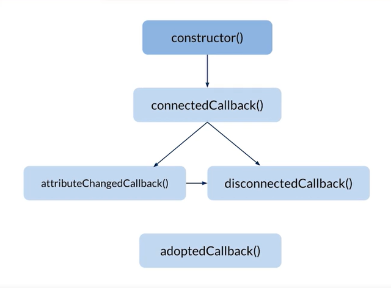

# ¿Qué son los Web components?

Los web components están hechos para ser reutilizables, encapsulamos cierto código que podemos reutilizar en diferentes partes de nuestra aplicación o diferentes aplicaciones, sin tener que repetir el código.

### ¿Qué problema resuelven?
El ecosistema de Js es sumamente grande, puesto que entre tantos Frameworks y librerias que existen ahi muchos que no se llevan del todo bien con el otro, como por ejemplo Angular... en donde el inicio y escalabilidad del sitio debe ser mayormente con componentes desarrollados con Angular.

Usar web componets resuelve esto porque únicamente usa vanilla js y usa los estándares web, lo cual hace que sean totalmente agnosticos de cualquier framework o libreria.

**"Los web components son primitivos de bajo nivel que te permiten definir tus propios elementos HTML"**

Los web components utilizan "Web Standards" para construirlos.

Los web components están construidos con web APIs

* **HTML Templates:** Etiquetas
* **Custom Elements:** Nos ayuda a definir una etiqueta que se convierte en una etiqueta estándar después
* **Shadow DOM:** Es la magia y nos permite encapsular el código.
* **Es Modules:** Los módulos que nos ayudan a importar cierto código de js a otro código de js y reutilizar ciertas cosas


# ¿Que son los Custom Elements?
Los customs elements viene hacer la definición de nuestras propias etiquetas HTML haciendo uso de los estándares web.

Se recomienda que el nombre de la etiqueta de nuestro "custom element" sea una composición de 2 palabras como mínimo separados por un "-". Esto es con la finalidad de evitar la colisión de nombres entre una etiqueta estándard de HTML5 y nuestras propias etiquetas.

Ejemplos:
```html 
<my-mapa></my-mapa>
<player-music></player-music>
```

# ¿Qué es el Shadow DOM?
No es algo nuevo y muchos los confunden con el VIRTUAL DOM.

El shadow DOM es un encapsulamiento perfecto que hace que el código que vive dentro NO co-exista con el código que vive fuera. Esto nos resuelve el problema de reescritura de estilos.

# HTML Template
Es una sola etiqueta de HTML

```html
<template></template>
```

Es una etiqueta un tanto "rara" porque pasar usarla en HTML, necesitas del uso de javascript.

Si se usa esta etiqueta directamente en el HTML, lo que nos va retornar es un "Document Fragment", que viene a ser un fragmento que es parte del DOM que necesitar ser clonado para ser renderizado. Esta es la razón por la cual es necesario la interacción de javascript.


Los web components utilizan este tipo etiqueta con el "Document Fragment" hace que todo el contenido de la etiqueta al momento que se renderiza en el DOM, se tenga mucha ventaja con el tema de performance... en el tema de como se van generando los nodos en el DOM.


# ES MODULES (HTML Imports)

Modulos de ECMASCRIPT 6, es la forma de utilizar codigo de js en otro documento de js.

Antes de usaba una etiqueta HTML imports que nos ayudaba a importar HTML en otro HTML, sin embargo, esta api NO se logro dar de alta en todos los navegadores.


# ¿Cúales son los beneficios de usar WEB COMPONENTS?

* **REUTILIZACIÓN:** Don't Repeat Yourself (you only have to build it once)

* **LEGIBILIDAD:** Hace más fácil a los demás entender el código. Mejor semántica.

* **MANTENIBILIDAD:** Cada uno de los componentes puede ser escrito y probado de forma individual, sin comprometer la aplicación completa.

* **INTEROPERABILIDAD:** Los frameworks y librerías no están hechos para coexistir entre ellos. Los Web Components sí.

* **CONSISTENCIA:** Gracias a la naturaleza reutilizable e interoperable de los Web Components ya no tendrás que crear los mismos componentes en diferentes frameworks o librerías.

# Ciclo de vida de un componente

* constructor: Directamente desde el JavaScript Engine, el constructor nos servirá para definir y cargar todas las variables en memoria que necesitemos, es mala práctica pintar el componente aquí
* connectedCallback: Cuando el componente ya está pintado dentro del DOM ypodemos hacer uso de él.
* attributeChangedCallback: Cuando un atributo de nuestro componente cambia
* disconnectedCallback: Cuando el componente se "destruye" o se quita del DOM
* adoptedCallback: Cuando el componente es movido a un nuevo DOM, básicamente cuando es pintado desde un iframe por ejemplo :D

